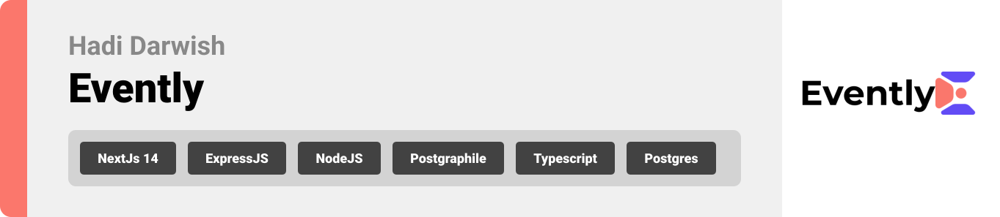

<br><br>

<!-- project philosophy -->


> Built on Next.js 14, the events application stands as a comprehensive, full-stack platform for managing events. It serves as a hub, spotlighting diverse events taking place globally. Featuring seamless payment processing through Stripe, you have the capability to purchase tickets for any event or even initiate and manage your own event.
>
> This platform aims to streamline the event management process by providing a user-friendly interface for both event organizers and attendees. We believe in enhancing the event experience by saving time, ensuring secure transactions, and promoting diverse events worldwide.

### Attendee Stories

- As an attendee, I want to browse events, so I can find ones that interest me.
- As an attendee, I want to purchase tickets online, so I can secure my spot without hassle.
- As an attendee, I want to see all my upcoming events, so I can plan my schedule accordingly.

### Organizer Stories

- As an organizer, I want to create and list new events, so I can attract attendees.
- As an organizer, I want to manage ticket sales, so I can track revenue and attendance.
- As an organizer, I want to have to paid directly, so I can receive funds quickly and securely.
  <br><br>
    <!-- Implementation -->
  

### User Screens (Mobile)

| Login screen                       | Register screen                 | Landing screen                 | Landing screen                  |
| ---------------------------------- | ------------------------------- | ------------------------------ | ------------------------------- |
| 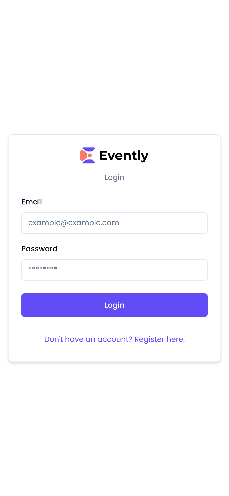     | 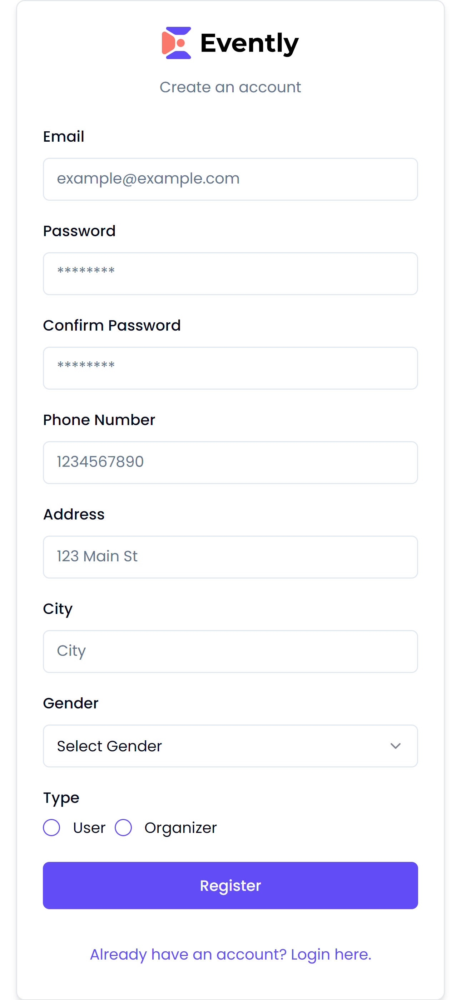 |  |  |
| My Tickets screen                  | Menu Screen                     | Order Screen                   | Checkout Screen                 |
| 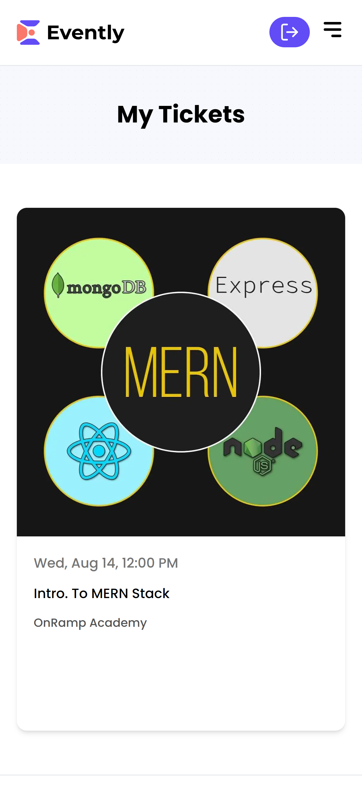 | 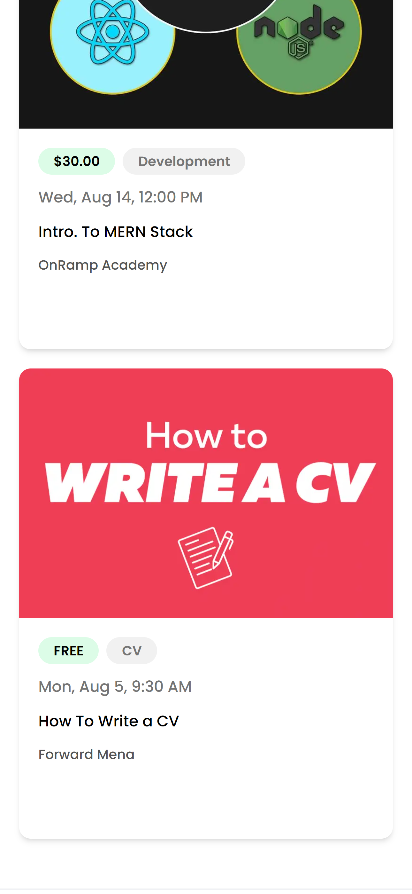     | 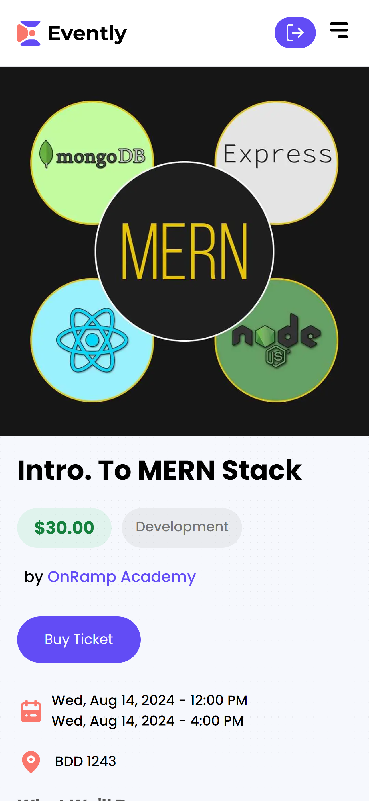   | 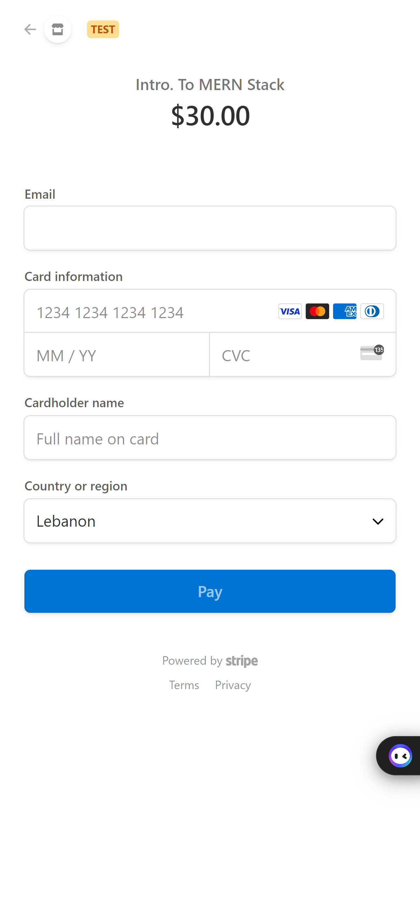 |

### User Screens (Web)

| Create Event screen                   | Event Details screen                     | Events Organized screen           |
| ------------------------------------- | ---------------------------------------- | --------------------------------- |
| 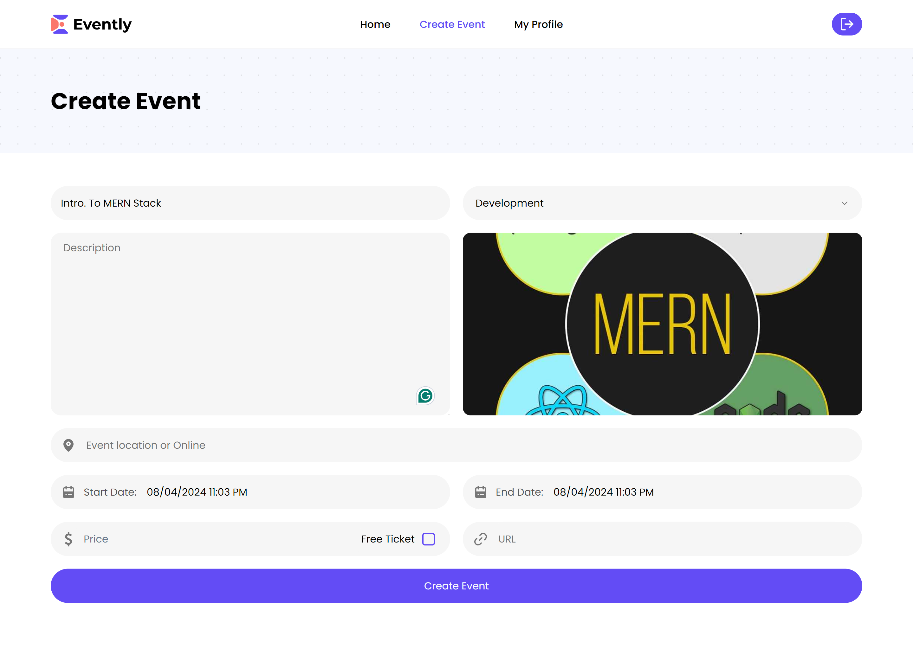 | 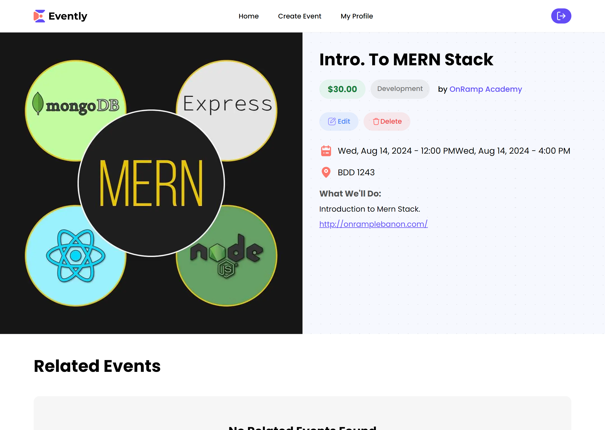 | 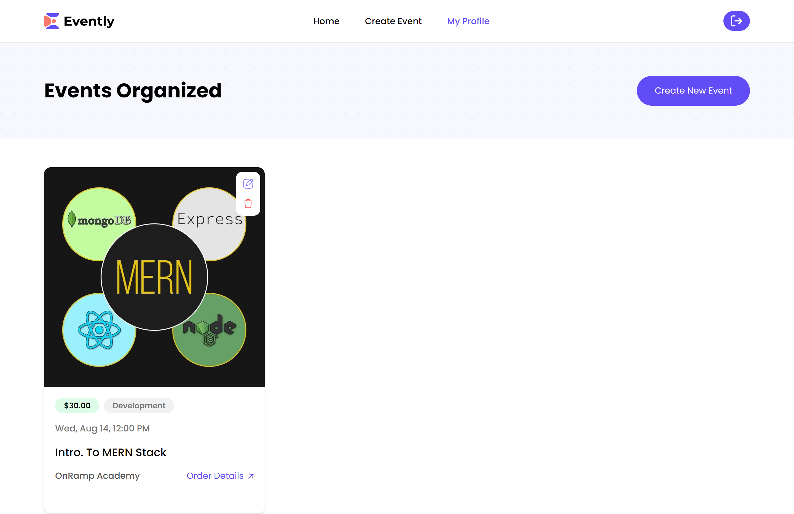 |
| Orders Details screen                 | Home Screen                              | Update Event Screen               |
| 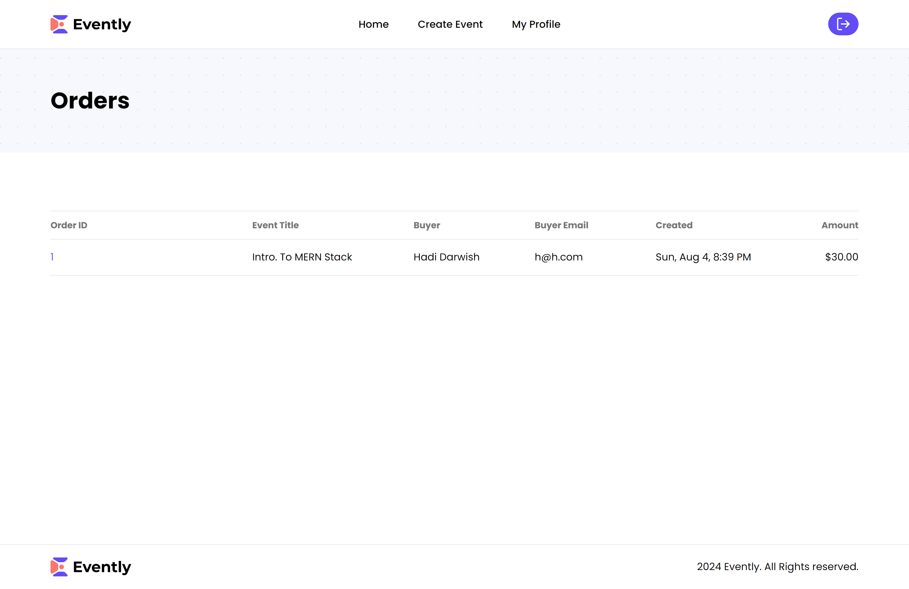   | 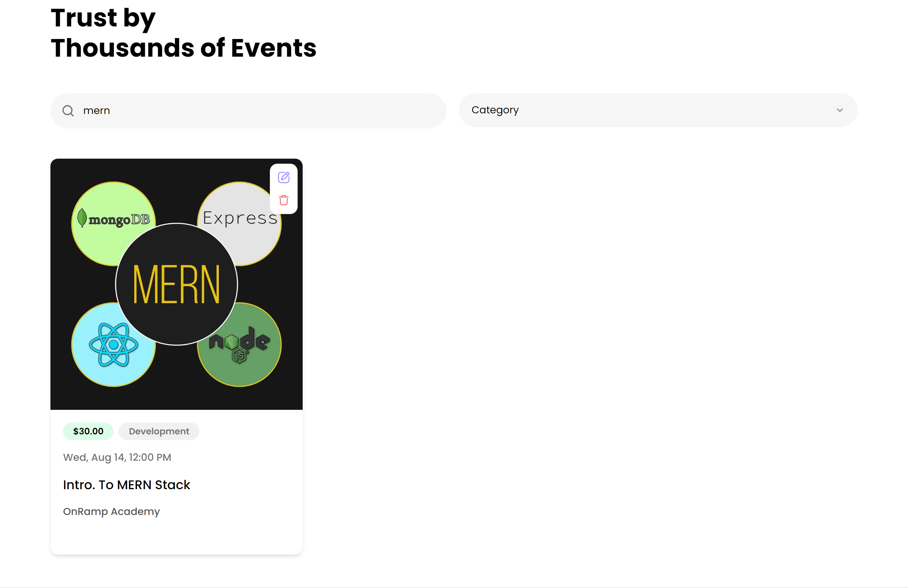          | 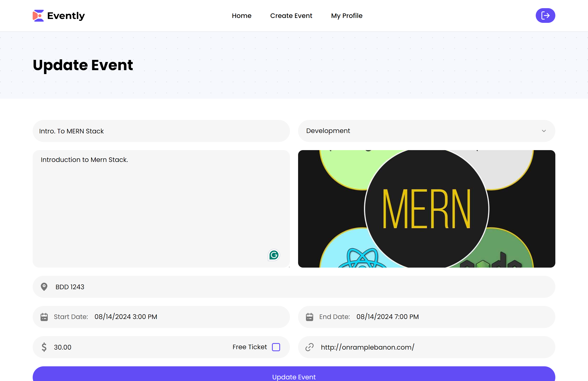     |

<br><br>

<!-- Tech stack -->


### Evently is built using the following technologies:

- This project uses the [Node.js](https://nodejs.org/) runtime environment, which allows us to run JavaScript on the server side.
- The frontend is built with [Next.js](https://nextjs.org/), a React framework that enables server-side rendering and static site generation.
- We use [TypeScript](https://www.typescriptlang.org/) to add static types to our JavaScript code, improving code quality and maintainability.
- For styling, the project utilizes [TailwindCSS](https://tailwindcss.com/), a utility-first CSS framework that allows for rapid UI development.
- Payment processing is handled by [Stripe](https://stripe.com/), enabling secure and seamless transactions.
- Data validation and parsing are managed with [Zod](https://zod.dev/), a TypeScript-first schema declaration and validation library.
- Form handling is simplified using [React Hook Form](https://react-hook-form.com/), which provides easy-to-use form validation and management.
- The project leverages [Shadcn](https://ui.shadcn.com/) for component libraries and design systems.
- File uploads are managed by [uploadthing](https://uploadthing.com/), which provides a simple and efficient way to handle file uploads.
- For the backend, we use [PostGraphile](https://www.graphile.org/postgraphile/), a tool that automatically creates a GraphQL API from a PostgreSQL database.
- The database used is [PostgreSQL](https://www.postgresql.org/), a powerful, open-source object-relational database system.

<br><br>

<!-- How to run -->


> To set up Evently locally, follow these steps:

### Prerequisites

This is an example of how to list things you need to use the software and how to install them.

- npm
  ```sh
  npm install npm@latest -g
  ```
- sqitch
  follow the installation guide from the following link: [sqitch](https://sqitch.org/)

### Installation

_Below is an example of how you can instruct your audience on installing and setting up your app. This template doesn't rely on any external dependencies or services._

1. Clone the repo
   ```sh
   git clone https://github.com/hadi-darwish/evently.git
   ```
2. Navigate to the project directory
   ```sh
    cd frontend
   ```
3. Install NPM packages

   ```sh
   npm install
   ```

   4. Set up the environment variables

   ```sh
    cp .env.example .env.local
   ```

   ```
   AUTH_SECRET=""
   ```

   You can generate a secret key using the following link: [Secret Key Generator](https://generate-secret.vercel.app/32)

   Follow the documentation of uploadthings of url: [uploadthing](https://uploadthing.com/)
   and stripe of url: [stripe](https://stripe.com/)
   to get the keys and set them in the .env.local file.

   Follow the same steps for the backend directory.

4. Run the development server

   ```sh
   npm run dev
   ```

5. Navigate to the backend directory

   ```sh
   cd backend
   ```

6. Install NPM packages

   ```sh
   npm install
   ```

7. Run the development server

   ```sh
   npm run start
   ```

8. Navigate to the database directory

   ```sh
   cd frontend
   ```

9. Run the sqitch commands

   ```sh
   sqitch deploy db:pg://username:password@localhost:5432/evently
   ```

   Replace the username and password with your database username and password.

10. Open [http://localhost:3000](http://localhost:3000) with your browser to see the result.

Now, you should be able to run Evently locally and explore its features.

<br><br>

<!-- Online website -->

# Use the following link to access the website:

### [Evently](https://evently-navy-seven.vercel.app/)
